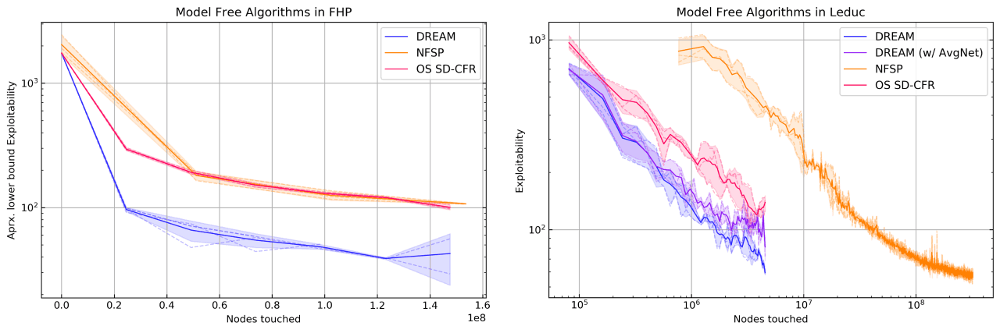

# DREAM: Deep Regret minimization with Advantage baselines and Model-free learning. 
A scalable implementation of [DREAM](https://arxiv.org/abs/2006.10410) [1]. DREAM is the state-of-the-art (June 2020) in multi-agent model-free Deep RL [1]. Here are two graphs showing how fast various model-free algorithms converge in the poker games Flop Hold'em and Leduc:



Also includes implementations of [Single Deep CFR (SD-CFR)](https://arxiv.org/pdf/1901.07621.pdf) [2], and [Deep CFR (SD-CFR)](https://arxiv.org/pdf/1811.00164.pdf) [3], and [Neural Fictitious Self-Play (NFSP)](https://arxiv.org/pdf/1603.01121.pdf) [4] in the [PokerRL](https://github.com/TinkeringCode/PokerRL) framework.

This codebase is designed for:
- Researchers to compare new methods to these baselines.
- Anyone wanting to learn about Deep RL in imperfect information games.
- Reproducability of results from our papers.

This implementation seamlessly scales from your local machine to hundreds of cores on AWS.

### Reproducing Results from DREAM (Steinberger et al. 2020) [1]
The run-script in the root directory of this repo each launch experiments as those presented in the paper.
We ran experiments in Leduc using one core per run on c5.9xlarge machines (i.e. many experiments on one machine in parallel)
and used one c5.24xlarge machines for three runs in FHP. We set the instance up for distributed runs as explained in
[PokerRL](https://github.com/TinkeringCode/PokerRL). Once started, results can be observed at `INSTANCE_IP:8888` in your browser.

VERY IMPORTANT NOTES:
- This implementation defines an iteration as one sequential update for BOTH players. Thus, **iteration 300 in the SD-CFR paper [2]
  is equivalent to iteration 150 in the Tensorboard logs!**
- Results on iteration 0 have no meaning since they compare a random neural network to an exactly uniform strategy.

## DREAM on your Local Machine
### Install locally
This codebase only supports Linux officially (Mac has not been tested).

First, please install Docker and download the [PyCrayon](https://github.com/torrvision/crayon) container. For dependency
management we recommend Miniconda. To install the dependencies, simply activate your conda environment and then
`pip install -r requirements.txt`.

### Running experiments locally
Before starting any algorithm, please spin up the log server by
```
docker run -d -p 8888:8888 -p 8889:8889 --name crayon alband/crayon
docker start crayon
```

You can now view logs at `localhost:8888` in your browser. To run DREAM, Deep CFR or SD-CFR with custom hyperparameters in
any Poker game supported by PokerRL, build a script similar to the ones in the root directory of this repo. Run-scripts define
the hyperparameters, the game to be played, and the evaluation metrics. Here is a very minimalistic example showing a
few of the available settings:

```
from PokerRL.game.games import StandardLeduc  # or any other game

from DeepCFR.EvalAgentDeepCFR import EvalAgentDeepCFR
from DeepCFR.TrainingProfile import TrainingProfile
from DeepCFR.workers.driver.Driver import Driver

if __name__ == '__main__':
    ctrl = Driver(t_prof=TrainingProfile(name="SD-CFR_LEDUC_EXAMPLE",
    
                                         eval_agent_export_freq=20,  # export API to play against the agent
                                         
                                         max_buffer_size_adv=3e6,
                                         n_traversals_per_iter=1500,
                                         n_batches_adv_training=750,
                                         init_adv_model="last", # "last" or "random"

                                         game_cls=StandardLeduc, # The game to play     
                                         
                                         eval_modes_of_algo=(
                                             EvalAgentDeepCFR.EVAL_MODE_SINGLE,  # Single Deep CFR (SD-CFR)
                                         ),

                                         DISTRIBUTED=False, # Run locally
                                         ),
                  eval_methods={
                      "br": 3, # evaluate Best Response every 3 iterations.
                  })
    ctrl.run()
```
Note that you can specify one or both averaging methods under `eval_modes_of_algo`.
Choosing both is useful to compare them as they will share the value networks! However, we showed in [2] that SD-CFR
is expected to perform better, is faster, and requires less memory.
                                         

## Cloud & Clusters
For deployment on AWS, whether single-core, many-core distributed, or on a cluster, please first follow
the tutorial in the corresponding section of [PokerRL](https://github.com/TinkeringCode/PokerRL)'s README.

We recommend forking this repository so you can write your own scripts but still have remote access through git.
In your run-script set either the `DISTRIBUTED` or the `CLUSTER` option of the TrainingProfile to True.
Moreover, you should specify the number of `LearnerActor` and evaluator workers (if applicable) you want to deploy.
Note that hyperparmeters ending with "_per_la" (e.g. the batch size) are effectively multiplied by the number of
workers. 

When running in DISTRIBUTED mode (i.e. one machine, many cores), simply ssh onto your AWS instance, get your code
onto it (e.g. through git cloning your forked repo) and start your run-script.
To fire up a cluster, define a `.yaml` cluster configuration that properly sets up your workers. Each of them
should have a copy of your forked repo as well as all dependencies on it.
Use `ray up ...` in an ssh session to the head of the cluster to start the job - more detailed instructions about 
the underlying framework we use for distributed computing can be found at [ray](https://github.com/ray-project/ray).


## Citing
If you use this repository in your research, you can cite it by citing PokerRL as follows:
```
@misc{steinberger2019pokerrl,
    author = {Eric Steinberger},
    title = {PokerRL},
    year = {2019},
    publisher = {GitHub},
    journal = {GitHub repository},
    howpublished = {\url{https://github.com/TinkeringCode/PokerRL}},
}
```


## Code Authors
* **Eric Steinberger - [Twitter] (https://twitter.com/EricSteinb)**


## License
This project is licensed under the MIT License - see the [LICENSE](LICENSE) file for details.


## References
[1] Steinberger, Lerer, Brown. "DREAM: Deep Regret minimization with Advantage baselines and Model-free learning." arXiv preprint https://arxiv.org/abs/2006.10410 (2020).

[2] Steinberger, Eric. "Single Deep Counterfactual Regret Minimization." arXiv preprint arXiv:1901.07621 (2019).

[3] Brown, Noam, et al. "Deep Counterfactual Regret Minimization." arXiv preprint arXiv:1811.00164 (2018).

[4] Heinrich, Johannes, and David Silver. "Deep reinforcement learning from self-play in imperfect-information games." arXiv preprint arXiv:1603.01121 (2016).
